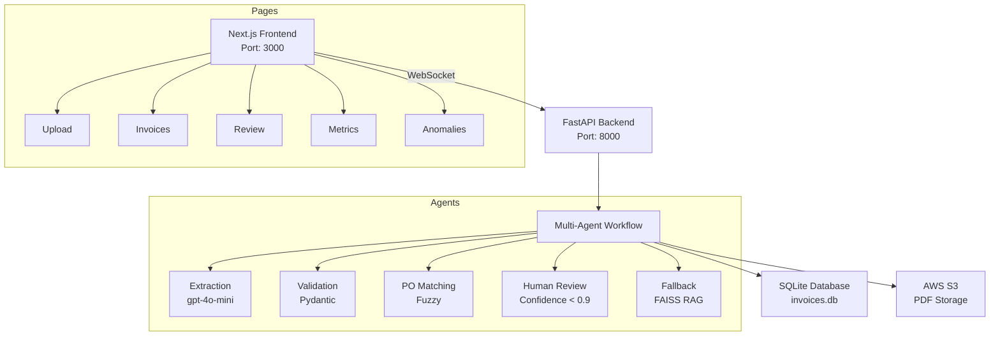

# 📊 Brim Invoice Processing System


## 🎯 Overview

This sophisticated invoice processing system leverages LangChain’s multi-agent workflow to automate extraction, validation, and purchase order (PO) matching. Designed as a technical challenge for Brim's Agentic AI Engineer position, it reduces manual processing time by over 75% while ensuring high accuracy through intelligent error handling and human-in-the-loop review. Key updates in the feature/database-integration branch include:
- SQLite Migration: Replaced JSON-based storage with SQLite (invoices.db) for scalable, efficient metadata management.
- AWS S3 Integration: Transitioned PDF storage to AWS S3 with public read access, enhancing reliability and scalability.

## 📋 Key Features

### Intelligent Processing Pipeline
- Processes PDFs from data/raw/invoices/ (35 invoices), stored in AWS S3
- Multi-agent system for extraction, validation, and PO matching
- RAG-based error handling with FAISS, using data/raw/test_samples/ (5 faulty PDFs)
- Asynchronous processing with SQLite-backed metadata

### Modern Frontend
- Next.js dashboard with real-time WebSocket updates
- Interactive invoice review with S3-hosted PDF previews
- Comprehensive metrics visualization

### Enterprise-Grade Architecture
- FastAPI backend with WebSocket support
- SQLite database (invoices.db) for structured data
- AWS S3 for PDF storage
- Fully containerized deployment

## Table of Contents

- [Overview](#overview)
- [Key Features](#key-features)
- [Development Journey](#development-journey)
- [Migration Challenges & Solutions](#migration-challenges--solutions)
- [Architecture](#architecture)
- [Setup Guide](#setup-guide)
- [CI/CD & Docker Hub](#cicd--docker-hub)
- [License](#license)
- [Contributing](#contributing)

## 🛠️ Development Journey

### Week 1: Core Development

#### Days 1–2: Foundation
- Set up FastAPI backend and Next.js frontend
- Built core extraction and validation logic with Pydantic models

#### Days 3–4: Enhancements
- Integrated FAISS-based RAG and OpenAI’s gpt-4o-mini for error handling
- Added PO matching with fuzzy logic and enhanced the frontend UI

#### Days 5–6: Stabilization
- Fixed WebSocket connectivity, file uploads, and PDF viewing issues
- Stabilized backend and frontend compatibility (Node.js 20)

#### Days 7–8: Database & Storage Upgrade
- Migrated from JSON to SQLite with migrate_json_to_db.py
- Integrated AWS S3 for PDF storage, optimizing WebSocket stability

## 🚧 Migration Challenges & Solutions

| Challenge | Solution |
|-----------|----------|
| S3 Upload Errors | Removed 'ACL': 'public-read'; configured bucket policies for public access |
| WebSocket Instability | Added ConnectionManager with heartbeat checks and reconnection logic |
| Database Migration | Created migrate_json_to_db.py to prevent duplicates and ensure smooth transition |
| Anomalies Page Glitch | Updated anomalies.tsx to enforce numeric page values |

## 🏗️ Architecture

### Project Structure

```plaintext
brim_invoice_nextjs/
├── Backend/Dockerfile
├── main.py
├── docker-compose.yml
├── README.md
├── requirements.txt
├── .gitignore
├── invoices.db
├── agents/
│   ├── base_agent.py
│   ├── extractor_agent.py
│   ├── fallback_agent.py
│   ├── human_review_agent.py
│   ├── matching_agent.py
│   ├── validator_agent.py
├── api/
│   ├── app.py
│   ├── review_api.py
├── config/
│   ├── logging_config.py
│   ├── monitoring.py
│   ├── settings.py
├── data/
│   ├── processed/
│   │   └── anomalies.json
│   ├── raw/
│   │   ├── invoices/
│   │   ├── test_invoice.txt
│   │   └── vendor_data.csv
│   ├── temp/
│   └── test_samples/
├── data_processing/
│   ├── anomaly_detection.py
│   ├── confidence_scoring.py
│   ├── document_parser.py
│   ├── ocr_helper.py
│   ├── po_matcher.py
│   ├── rag_helper.py
├── frontend-nextjs/
│   ├── Dockerfile
│   ├── next.config.ts
│   ├── package.json
│   ├── tailwind.config.ts
│   ├── tsconfig.json
│   ├── lib/
│   │   └── api.ts
│   └── src/
│       ├── pages/
│       │   ├── _app.tsx
│       │   ├── anomalies.tsx
│       │   ├── index.tsx
│       │   ├── invoices.tsx
│       │   ├── metrics.tsx
│       │   ├── review.tsx
│       │   └── upload.tsx
│       ├── components/
│       │   └── Layout.tsx
│       └── styles/
│           └── globals.css
├── models/
│   ├── invoice.py
│   ├── validation_schema.py
└── workflows/
    ├── orchestrator.py
```

### Architecture Diagram

```plaintext
+-------------------+
|    Next.js UI     |
| - React, Next.js  |
| - Tailwind CSS    |
+-------------------+
          ↓
+---------+---------+
| FastAPI Backend   |
| - WebSocket       |
+---------+---------+
          ↓
+---------+---------+
| Multi-Agent Workflow |
| - Extraction      |
| - Validation      |
| - PO Matching     |
| - Human Review    |
| - Fallback (FAISS)|
+---------+---------+
          ↓
+---------+---------+
| SQLite (invoices.db) | AWS S3 (PDFs) |
+-------------------+-----------------+
```



## ⚙️ Setup Guide

### Prerequisites
- Docker & Docker Compose
- AWS account with S3 access
- OpenAI API key

> **Note**: The setup instructions assume a Unix-like environment (e.g., Linux, macOS). For Windows, use WSL or adjust commands accordingly.

### Installation

1. **Clone Repository:**
```bash
git clone https://github.com/yancotta/brim_invoice_nextjs.git
cd brim_invoice_nextjs
git checkout feature/database-integration
```

2. **Configure Environment:**
Create `.env` in the root:
```bash
OPENAI_API_KEY=your_openai_key
AWS_ACCESS_KEY_ID=your_access_key
AWS_SECRET_ACCESS_KEY=your_secret_key
BUCKET_NAME=your_bucket_name
```

3. **Run with Docker Compose:**
Save this as `docker-compose.yml`:
```yaml
version: '3.8'
services:
  backend:
    image: yancotta/brim_invoice_nextjs_backend:feature-database-integration
    ports:
      - "8000:8000"
    environment:
      - OPENAI_API_KEY=${OPENAI_API_KEY}
      - AWS_ACCESS_KEY_ID=${AWS_ACCESS_KEY_ID}
      - AWS_SECRET_ACCESS_KEY=${AWS_SECRET_ACCESS_KEY}
      - BUCKET_NAME=${BUCKET_NAME}
    volumes:
      - ./invoices.db:/app/invoices.db
      - ./data:/app/data
  frontend:
    image: yancotta/brim_invoice_nextjs_frontend:feature-database-integration
    ports:
      - "3000:3000"
    depends_on:
      - backend
```

Then run:
```bash
docker compose up -d
```

4. **Access:**
- Frontend: http://localhost:3000
- API Docs: http://localhost:8000/docs

5. **Verify Data (Optional):**
```bash
sqlite3 invoices.db "SELECT COUNT(*) FROM invoices"
```

## 🚀 CI/CD & Docker Hub

The feature/database-integration branch uses GitHub Actions for CI/CD, building and pushing Docker images on every push:
- Backend: yancotta/brim_invoice_nextjs_backend
  - Tag: feature-database-integration
  - Size: 1.01 GB
  - Updated: February 26, 2025
- Frontend: yancotta/brim_invoice_nextjs_frontend
  - Tag: feature-database-integration
  - Size: 299.7 MB
  - Updated: February 26, 2025

**Built with ❤️ for Brim's Technical Challenge**

### Key Improvements
- Streamlined Sections: Condensed repetitive content (e.g., merged redundant setup instructions)
- Enhanced Readability: Used consistent formatting, tables, and concise bullet points
- Removed Redundancies: Eliminated duplicate file references and outdated instructions
- Polished Flow: Organized sections logically (Overview → Features → Development → Architecture → Setup → CI/CD)

## License

This project is licensed under the [MIT License](LICENSE).