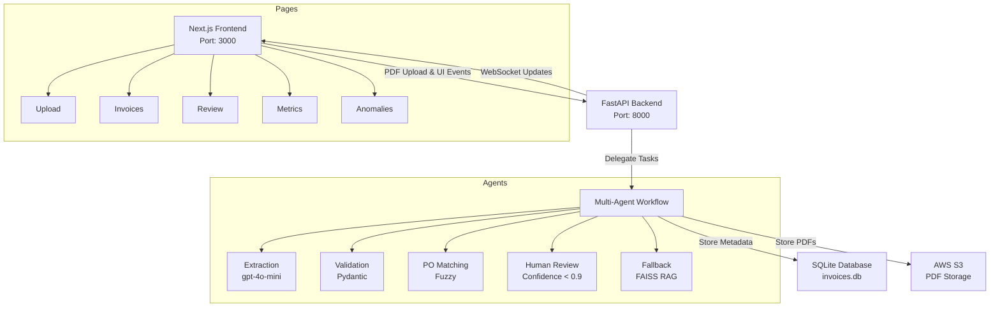

# 📊 Brim Invoice Processing System Version #3


## Overview

This sophisticated invoice processing system, initially developed as a prototype for Brim’s Agentic AI Engineer technical challenge, leverages LangChain’s multi-agent workflow to automate extraction, validation, and purchase order (PO) matching. Designed to reduce manual processing time by over 75%, it ensures high accuracy through intelligent error handling and human-in-the-loop review processes. A standout feature is the implementation of Retrieval-Augmented Classification (RAC)—an adaptation of RAG—using FAISS with data/raw/test_samples/ (5 faulty PDFs) to minimize human intervention by classifying and resolving common errors autonomously.

The project evolved in phases:

- Prototype (Streamlit Version): A lightweight, Streamlit-based solution for small-scale local enterprises, relying on local JSON storage (structured_invoices.json) for quick deployment and testing.

- Next.js Version: A robust iteration with a modern Next.js frontend, enhancing the UI with real-time WebSocket updates and maintaining JSON storage for simplicity.

- Scalable Version (feature/database-integration Branch): The current, production-ready state, integrating SQLite (invoices.db) for efficient metadata management and AWS S3 for scalable PDF storage. While PostgreSQL was considered for larger-scale needs (e.g., 5,000+ invoices/month), SQLite was chosen as sufficient for the target volume of 5,000 invoices/month.

This staged approach—starting small, iterating to a functional Next.js system, and scaling with cloud and database technologies—demonstrates a practical path from prototype to enterprise-ready solution.

| Variant         | Purpose     | Key Features                  |
|-----------------|-------------|-------------------------------|
| Streamlit       | Prototyping | Simple UI, Python-based       |
| Next.js         | Production  | WebSockets, Modern UI         |
| AWS S3 + SQLite | Scalability | S3 storage, SQLite metadata   |

## 📋 Key Features

### Intelligent Processing Pipeline
- Processes PDFs from data/raw/invoices/ (35 invoices), stored in AWS S3
- Multi-agent system for extraction, validation, and PO matching
- RAG-based error handling with FAISS, using data/raw/test_samples/ (5 faulty PDFs)
- Asynchronous processing with SQLite-backed metadata

### Modern Frontend
- Next.js dashboard with real-time WebSocket updates
- Interactive invoice review with S3-hosted PDF previews
- Comprehensive metrics visualization

### Enterprise-Grade Architecture
- FastAPI backend with WebSocket support
- SQLite database (invoices.db) for structured data
- AWS S3 for PDF storage
- Scalable design supports thousands of invoices with minimal latency
- Fully containerized deployment

## Table of Contents

- [Overview](#overview)
- [Key Features](#key-features)
- [Development Journey](#development-journey)
- [Migration Challenges & Solutions](#migration-challenges--solutions)
- [Architecture](#architecture)
- [Setup Guide](#setup-guide)
- [CI/CD & Docker Hub](#cicd--docker-hub)
- [License](#license)
- [Contributing](#contributing)

## 🛠️ Development Journey

### Week 1: Core Development

#### Days 1–2: Foundation
- Set up FastAPI backend and Next.js frontend
- Built core extraction and validation logic with Pydantic models

#### Days 3–4: Enhancements
- Integrated FAISS-based RAG and OpenAI’s gpt-4o-mini for error handling
- Added PO matching with fuzzy logic and enhanced the frontend UI

#### Days 5–6: Stabilization
- Fixed WebSocket connectivity, file uploads, and PDF viewing issues
- Stabilized backend and frontend compatibility (Node.js 20)

#### Days 7–8: Database & Storage Upgrade
- Migrated from JSON to SQLite with migrate_json_to_db.py
- Integrated AWS S3 for PDF storage, optimizing WebSocket stability
- Refined documentation and made demo video

## 🚧 Migration Challenges & Solutions

| Challenge | Solution |
|-----------|----------|
| S3 Upload Errors | Removed 'ACL': 'public-read'; configured bucket policies for public access |
| WebSocket Instability | Added ConnectionManager with heartbeat checks and reconnection logic |
| Database Migration | Created migrate_json_to_db.py to prevent duplicates and ensure smooth transition |
| Anomalies Page Glitch | Updated anomalies.tsx to enforce numeric page values |

## 🏗️ Architecture

### Project Structure

```plaintext
brim_invoice_nextjs/
├── Backend/Dockerfile
├── main.py
├── docker-compose.yml
├── README.md
├── requirements.txt
├── .gitignore
├── invoices.db
├── agents/
│   ├── base_agent.py
│   ├── extractor_agent.py
│   ├── fallback_agent.py
│   ├── human_review_agent.py
│   ├── matching_agent.py
│   ├── validator_agent.py
├── api/
│   ├── app.py
│   ├── review_api.py
├── config/
│   ├── logging_config.py
│   ├── monitoring.py
│   ├── settings.py
├── data/
│   ├── processed/
│   │   └── anomalies.json
│   ├── raw/
│   │   ├── invoices/
│   │   ├── test_invoice.txt
│   │   └── vendor_data.csv
│   ├── temp/
│   └── test_samples/
├── data_processing/
│   ├── anomaly_detection.py
│   ├── confidence_scoring.py
│   ├── document_parser.py
│   ├── ocr_helper.py
│   ├── po_matcher.py
│   ├── rag_helper.py
├── frontend-nextjs/
│   ├── Dockerfile
│   ├── next.config.ts
│   ├── package.json
│   ├── tailwind.config.ts
│   ├── tsconfig.json
│   ├── lib/
│   │   └── api.ts
│   └── src/
│       ├── pages/
│       │   ├── _app.tsx
│       │   ├── anomalies.tsx
│       │   ├── index.tsx
│       │   ├── invoices.tsx
│       │   ├── metrics.tsx
│       │   ├── review.tsx
│       │   └── upload.tsx
│       ├── components/
│       │   └── Layout.tsx
│       └── styles/
│           └── globals.css
├── models/
│   ├── invoice.py
│   ├── validation_schema.py
└── workflows/
    ├── orchestrator.py
```

### Architecture Diagram

```plaintext
           +-------------------+
           |    Next.js UI     |
           | - React, Next.js  |
           | - Tailwind CSS    |
           +-------------------+
                     ↓
           +---------+---------+
           | FastAPI Backend   |
           | - WebSocket       |
           +---------+---------+
                     ↓
           +---------+---------+
          |Multi-Agent Workflow|
           | - Extraction      |
           | - Validation      |
           | - PO Matching     |
           | - Human Review    |
           | - Fallback (FAISS)|
           +---------+---------+
                     ↓
+---------+---------++---------+-------+
| SQLite (invoices.db) | AWS S3 (PDFs) |
+-------------------+-----------------+
```

## ⚙️ Setup Guide

### Prerequisites
- Docker & Docker Compose
- AWS account with S3 access
- OpenAI API key

> **Note**: The setup instructions assume a Unix-like environment (e.g., Linux, macOS). For Windows, use WSL or adjust commands accordingly.

### Quick Start

1. **Clone the Repository:**
```bash
git clone -b feature/database-integration https://github.com/YanCotta/brim_invoice_nextjs.git brim_invoice_nextjs_feature
cd brim_invoice_nextjs_feature
git branch  # make sure you're in the right branch
```

2. **Set Up Environment Variables:**
Create a `.env` file with your credentials:
```bash
OPENAI_API_KEY=your_key
AWS_ACCESS_KEY_ID=your_access_key
AWS_SECRET_ACCESS_KEY=your_secret_key
BUCKET_NAME=your_bucket_name
```

3. **Run the Application:**
```bash
docker compose up -d
```

### Using Pre-built Images

For the feature/database-integration branch, you can use pre-built Docker images from Docker Hub:
```bash
# Pull images from Docker Hub
docker pull yancotta/brim_invoice_nextjs_backend:feature-database-integration
docker pull yancotta/brim_invoice_nextjs_frontend:feature-database-integration
```

#### Image Details

**Backend Image:**
- Name: `yancotta/brim_invoice_nextjs_backend:feature-database-integration`
- Description: Brim's Tech Test - Next.js Backend with SQLite and AWS S3 integration
- GitHub: https://github.com/YanCotta/brim_invoice_nextjs
- Size: 1.01 GB
- OS/Arch: linux/amd64
- Digest: bc0bfcdf4d1a

**Frontend Image:**
- Name: `yancotta/brim_invoice_nextjs_frontend:feature-database-integration`
- Description: Brim's Tech Test - Next.js Frontend with enhanced database features
- GitHub: https://github.com/YanCotta/brim_invoice_nextjs
- Size: 299.7 MB
- OS/Arch: linux/amd64

4. **Verify Installation:**
- Visit http://localhost:3000 to confirm the frontend is running
- Access API docs at http://localhost:8000/docs

### Detailed Installation

1. **Configure AWS S3:**
```json
{
  "Version": "2012-10-17",
  "Statement": [
    {
      "Sid": "PublicReadGetObject",
      "Effect": "Allow",
      "Principal": "*",
      "Action": "s3:GetObject",
      "Resource": "arn:aws:s3:::your-bucket-name/*"
    }
  ]
}
```
- Disable "Block all public access" in bucket settings

2. **Migration (Optional):**
Only needed when upgrading from JSON-based versions:
```bash
python scripts/migrate_json_to_db.py --json-path data/processed/invoices.json
sqlite3 invoices.db "SELECT COUNT(*) FROM invoices"
```

3. **Docker Configuration:**
Save as `docker-compose.yml`:
```yaml
version: '3.8'
services:
  backend:
    image: yancotta/brim_invoice_nextjs_backend:feature-database-integration
    ports:
      - "8000:8000"
    environment:
      - OPENAI_API_KEY=${OPENAI_API_KEY}
      - AWS_ACCESS_KEY_ID=${AWS_ACCESS_KEY_ID}
      - AWS_SECRET_ACCESS_KEY=${AWS_SECRET_ACCESS_KEY}
      - BUCKET_NAME=${BUCKET_NAME}
    volumes:
      - ./invoices.db:/app/invoices.db
      - ./data:/app/data
  frontend:
    image: yancotta/brim_invoice_nextjs_frontend:feature-database-integration
    ports:
      - "3000:3000"
    depends_on:
      - backend
```

## 🚀 CI/CD & Docker Hub

The feature/database-integration branch uses GitHub Actions for CI/CD, building and pushing Docker images on every push:
- Backend: yancotta/brim_invoice_nextjs_backend
  - Tag: feature-database-integration
  - Size: 1.01 GB
  - Updated: February 26, 2025
- Frontend: yancotta/brim_invoice_nextjs_frontend
  - Tag: feature-database-integration 
  - Size: 299.7 MB
  - Updated: February 26, 2025

> **Quick Start**: Pull images directly from Docker Hub and run `docker compose up -d` to skip building locally.

**Built with ❤️ using LangChain, OpenAI, SQLite, AWS S3, and more for Brim's Technical Challenge**

## License

This project is licensed under the [MIT License](LICENSE).