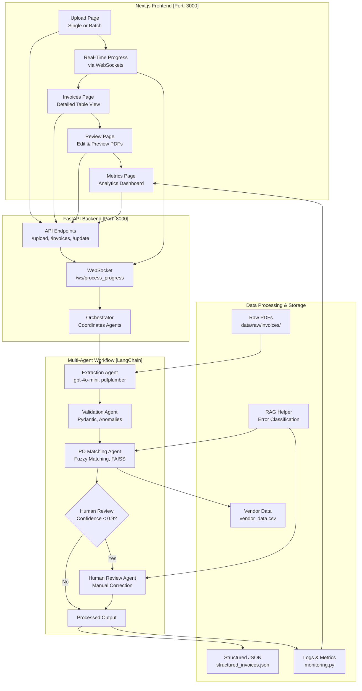

# 📊 Brim Invoice Processing System (Next.js Frontend)

[](https://www.python.org/downloads/)
[](https://nodejs.org/)
[](https://fastapi.tiangolo.com/)
[](https://nextjs.org/)
[](https://openai.com/)

## Overview

This sophisticated invoice processing system, initially developed as a prototype for Brim’s Agentic AI Engineer technical challenge, leverages LangChain’s multi-agent workflow to automate extraction, validation, and purchase order (PO) matching. Designed to reduce manual processing time by over 75%, it ensures high accuracy through intelligent error handling and human-in-the-loop review processes. A standout feature is the implementation of Retrieval-Augmented Classification (RAC)—an adaptation of RAG—using FAISS with data/raw/test_samples/ (5 faulty PDFs) to minimize human intervention by classifying and resolving common errors autonomously.

The project evolved in phases:

- Prototype (Streamlit Version): A lightweight, Streamlit-based solution for small-scale local enterprises, relying on local JSON storage (structured_invoices.json) for quick deployment and testing.

- Next.js Version: A robust iteration with a modern Next.js frontend, enhancing the UI with real-time WebSocket updates and maintaining JSON storage for simplicity.

- Scalable Version (feature/database-integration Branch): The current, production-ready state, integrating SQLite (invoices.db) for efficient metadata management and AWS S3 for scalable PDF storage. While PostgreSQL was considered for larger-scale needs (e.g., 5,000+ invoices/month), SQLite was chosen as sufficient for the target volume of 5,000 invoices/month.

This staged approach—starting small, iterating to a functional Next.js system, and scaling with cloud and database technologies—demonstrates a practical path from prototype to enterprise-ready solution.

## 📋 Key Features

- **Intelligent Processing Pipeline**
  - Processes PDFs from:
    - `data/raw/invoices/` (35 invoices)
  - Multi-agent system for extraction, validation, and matching
  - RAG-based error handling with FAISS `data/raw/test_samples/` -> (5 faulty PDFs examples to reduce the need for human review)
  - Asynchronous processing with robust error management

- **Modern Frontend Interface**
  - Next.js-powered dashboard
  - Real-time processing updates with WebSockets
  - Interactive invoice review system
  - Comprehensive metrics visualization

- **Enterprise-Grade Architecture**
  - FastAPI backend with WebSocket support
  - Structured logging and monitoring
  - Comprehensive test coverage
  - Containerized deployment ready

## Development Journey

### Week 1: Foundation & Core Development

#### Day 1: Project Planning and Setup

- 🎯 **Objectives Achieved**
  - Organized detailed 10-day development roadmap
  - Analyzed technical challenge requirements
  - Initialized project structure

- 🛠️ **Technical Implementation**
  - Set up FastAPI backend and Next.js frontend
  - Installed core dependencies:
    - LangChain (0.2.16)
    - PDF processing (pdfplumber)
    - OCR capabilities (pytesseract)

#### Day 2: Invoice Processing Foundation

- 🎯 **Objectives Achieved**
  - Implemented core extraction logic
  - Established validation framework

- 🛠️ **Technical Implementation**
  - Developed InvoiceExtractionAgent with Pydantic models
  - Implemented PDF parsing and OCR pipeline
  - Created validation system with anomaly detection

#### Day 3: Intelligence & Error Handling

- 🎯 **Objectives Achieved**
  - Enhanced system reliability
  - Improved extraction accuracy

- 🛠️ **Technical Implementation**
  - Integrated FAISS-based RAG for error handling
  - Migrated from Mistral 7B to OpenAI's gpt-4o-mini API
  - Implemented performance monitoring
  - Added fallback mechanisms

#### Day 4: Advanced Features & Frontend

- 🎯 **Objectives Achieved**
  - Completed PO matching system
  - Enhanced user interface

- 🛠️ **Technical Implementation**
  - Built PurchaseOrderMatchingAgent with fuzzy matching
  - Migrated from Streamlit to Next.js
  - Implemented advanced frontend features

#### Day 5: System Refinement

- 🎯 **Objectives Achieved**
  - Resolved critical system issues
  - Enhanced user experience

- 🛠️ **Technical Fixes**
  1. **WebSocket Connectivity**
     - Issue: Connection failures during batch processing
     - Solution: Implemented proper WebSocket handling

  2. **File Upload Reliability**
     - Issue: 422 errors with invalid files
     - Solution: Enhanced error handling and user feedback

  3. **PDF Viewing System**
     - Issue: 404 errors in PDF preview
     - Solution: Restructured PDF storage and serving

  4. **Data Format Consistency**
     - Issue: Date format inconsistencies
     - Solution: Standardized date handling (yyyy-MM-dd)

  5. **Batch Processing UX**
     - Issue: Multiple submission issues
     - Solution: Implemented proper loading states and safeguards

#### Day 6: Stabilization and Bug Fixes

- 🎯 **Objectives Achieved**
  - Stabilized backend operations
  - Resolved frontend compatibility issues
  - Fixed critical bugs in processing pipeline
  - Resolved batch processing stalls
  - Restored PDF viewing functionality
  - Fixed infinite loading issues

- 🛠️ **Technical Implementation**
  1. **Backend Stabilization**
     - Fixed `uvicorn.run()` configuration
     - Optimized WebSocket connections
     - Enhanced error logging
     - Reduced WebSocket broadcast frequency
     - Improved PDF serving logic

  2. **Node.js Environment**
     - Updated to Node.js 20
     - Resolved dependency conflicts
     - Converted Next.js configuration

  3. **Frontend Fixes**
     - Implemented proper PDF validation
     - Enhanced review page logic
     - Fixed invoice processing feedback
     - Added robust error handling
     - Limited fetchInvoices retries
     - Improved PDF viewing error handling

  4. **Configuration Updates**
     - Migrated from `next.config.ts` to `next.config.js`
     - Updated package dependencies
     - Optimized build configuration

  5. **Critical System Improvements**
     - Fixed batch processing stalls at 19/35 or 34/35
     - Resolved PDF viewing 404 errors
     - Fixed 'Refreshing...' state on invoices page
     - Implemented graceful error handling
     - Enhanced WebSocket stability

- **More Technical Fixes**:
  - Merged `api/human_review_api.py` into `api/review_api.py`, consolidating review functionality into a single API module running on port 8000, eliminating redundancy.
  - Removed `workflows/pipeline.py` as its functionality is fully covered by `workflows/orchestrator.py`, ensuring a single, robust workflow manager.
  - Reviewed `frontend-nextjs/public/` directory and removed unnecessary SVG files (e.g., `file.svg`, `globe.svg`) not referenced in the application, reducing build size.
  - Verified `frontend-nextjs/src/pages/anomalies.tsx` integration, confirming it’s linked to the backend via `lib/api.ts` for anomaly retrieval, and kept as a functional page (tested by uploading a PDF of my resume).
  - Ensured `lib/api.ts` only handles API client logic without duplicating backend processing, maintaining clear separation of concerns.

## Architecture

### Project Structure

```plaintext
brim_invoice_nextjs/
├── Backend/Dockerfile
├── main.py
├── package.json
├── package-lock.json
├── docker-compose.yml
├── README.md
├── requirements.txt
├── .gitignore
├── agents/
│   ├── __init__.py
│   ├── base_agent.py
│   ├── extractor_agent.py
│   ├── fallback_agent.py
│   ├── human_review_agent.py
│   ├── matching_agent.py
│   ├── validator_agent.py
│       
├── api/
│   ├── __init__.py
│   ├── app.py
│   ├── review_api.py  
│       
├── config/
│   ├── __init__.py
│   ├── logging_config.py
│   ├── monitoring.py
│   ├── settings.py
│ 
├── data/
│   ├── processed/
│   │   └── anomalies.json
│   │   └── structured_invoices.json
│   ├── raw/
│   │   └── invoices/ *pdfs
│   │   └── test_invoice.txt
│   │   └── vendor_data.csv
│   ├── temp/
│   │   └── … (temporary files)
│   └── test_samples/
│       └── … (sample faulty invoices for rag_helper.py)
├── data_processing/
│   ├── __init__.py
│   ├── anomaly_detection.py
│   ├── confidence_scoring.py
│   ├── document_parser.py
│   ├── ocr_helper.py
│   ├── po_matcher.py
│   ├── rag_helper.py
│       
├── frontend-nextjs/
│   ├── eslint.config.mjs
│   ├── Dockerfile
│   ├── next-env.d.ts
│   ├── next.config.ts
│   ├── package.json
│   ├── postcss.config.mjs
│   ├── tailwind.config.ts
│   ├── tsconfig.json
│   ├── lib/
│   │   └── api.ts
│   └── src/
│       ├── pages/
│       │   ├── _app.tsx
│       │   ├── anomalies.tsx  
│       │   ├── index.tsx
│       │   ├── invoices.tsx
│       │   ├── metrics.tsx
│       │   └── review.tsx
│       │   └── upload.tsx
│       ├── components/
│       │   └── Layout.tsx
│       └── styles/
│           └── globals.css
├── models/
│   ├── __init__.py
│   ├── invoice.py
│   ├── validation_schema.py
│       
└── workflows/
    ├── __init__.py
    ├── orchestrator.py  
      
```

### Architecture Diagram (both project variants; different reps)

```plaintext
            +-------------------+
            |    Next.js UI     |
            | (Production-ready)|
            | - React, Next.js  |
            | - Tailwind CSS    |
            +-------------------+
                       |
                +------+------+
                | FastAPI     |
                | Backend     |
                | - WebSocket |
                |   Support   |
                +------+------+
                       |
           +-----------+-------------+
           |                         |
+-------------------+       +-------------------+
|   Extraction      |       |   Validation      |
|   Agent           |       |   Agent           |
| - gpt-4o-mini     |       | - Pydantic Models |
| - pdfplumber      |       |                   |
| - pytesseract     |       +-------------------+
+-------------------+                |
           |                         |
           +-----------+-------------+
                       |
                +------+------+
                | PO Matching |
                |    Agent    |
                | - Fuzzy      |
                |   Matching   |
                +------+------+
                       |
                +------+------+
                | Human Review|
                |    Agent    |
                | - Confidence|
                |   < 0.9     |
                +------+------+
                       |
                +------+------+
                | Fallback    |
                |    Agent    |
                | - FAISS RAG  |
                +------+------+
                       |
                +------+------+
                | Data Storage|
                | - structured|
                |   _invoices |
                | - anomalies  |
                +------+------+
```



## Setup Guide

### Prerequisites

- Python 3.12+
- Node.js 20.x
- Virtual environment tool
- Git
- OpenAI API key
- Sample data files

### Step-by-Step Installation

1. **Clone Repository**

### Setup Guide (Dockerized)

1. **Clone the repository**:
   ```bash
   git clone https://github.com/YanCotta/brim_invoice_nextjs.git brim_invoice_nextjs_main
   cd brim_invoice_nextjs_main
   git branch #(make sure you are in the right branch)

2. **Build & Run with Docker**
   ```bash
   # Create .env file in root directory
   echo "OPENAI_API_KEY=your_api_key_here" > .env

   # Build and run with Docker Compose
   docker compose up --build -d
   ```

3. **Access the Application**
   - Frontend: http://localhost:3000
   - Backend: http://localhost:8000/docs

4. **Using Pre-built Images** (Optional)
   ```bash
   # Pull images from Docker Hub
   docker pull yancotta/brim_invoice_nextjs_backend:latest
   docker pull yancotta/brim_invoice_nextjs_frontend:latest
   ```

### Using Pre-built Images

1. **Create a docker-compose.yml**:
   ```yaml
   version: '3.8'
   services:
     backend:
       image: yancotta/brim_invoice_nextjs_backend:latest
       ports:
         - "8000:8000"
       environment:
         - OPENAI_API_KEY=${OPENAI_API_KEY}
       volumes:
         - ./data:/app/data

     frontend:
       image: yancotta/brim_invoice_nextjs_frontend:latest
       ports:
         - "3000:3000"
       depends_on:
         - backend
   ```

### CI/CD Pipeline

This project uses GitHub Actions to automatically build and push Docker images to Docker Hub whenever changes are pushed to the repository.

Pre-built images are available at:
- Backend: `yancotta/brim_invoice_nextjs_backend:latest`
- Frontend: `yancotta/brim_invoice_nextjs_frontend:latest`

### Core Workflows

1. **Process Invoices**
   - Upload at `/upload`
   - View at `/invoices`
   - Review at `/review`
   - Monitor at `/metrics`

2. **System Features**
   - Automatic duplicate detection
   - Confidence scoring (≥0.9 auto-process, <0.9 review)
   - Asynchronous processing
   - Comprehensive logging

### Dependencies

#### Frontend

- Next.js ^14.2.24
- React ^18.2.0
- React Hook Form ^7.50.1
- TailwindCSS ^3.4.1
- TypeScript ^5.3.3

#### Backend

- FastAPI
- LangChain
- OpenAI
- PDFPlumber
- Pytesseract

## Project Progress

### Completed (Days 1-7)

- ✅ Multi-agent system implementation
- ✅ Frontend migration (Streamlit → Next.js)
- ✅ OpenAI API integration
- ✅ RAG-based error handling
- ✅ Critical system improvements
- ✅ Project Refinement and Optimization
- ✅ Documentation & Testing
- ✅ Dockerized and implemented CI/CD

---

**Built with ❤️ for the Technical Challenge**